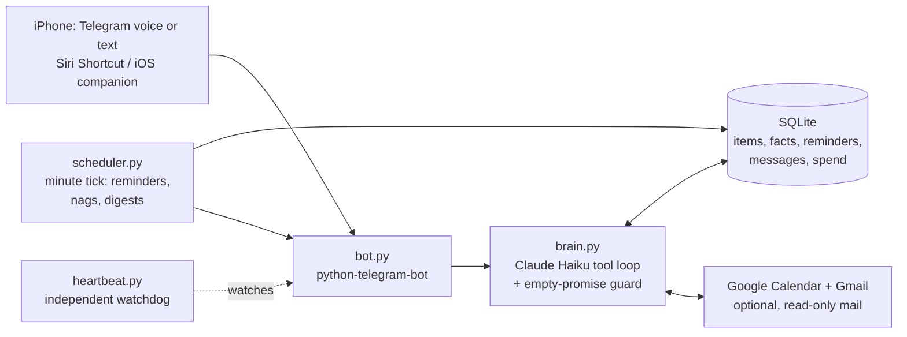

# aissistant

A personal AI assistant you talk to like a person, that never loses what you said.

I wanted an assistant that actually held the things I said out loud: errands, appointments,
"remind me the night before," a running pushup count. Existing to-do apps require you to stop
and type into forms, so they don't get used. I built one on Telegram with a Claude brain.
Two people have used it as their daily driver since July 2026. It costs a few cents per day
per person to run, and it is covered by 240+ unit tests plus a 35-check suite that runs
against the live model.

A representative exchange (voice memo in, structured commitments out):

```
You  🎤  "ok brain dump — return the blue dress to nordstrom by friday,
          rent's due the first of every month, and remind me the night
          before AND the morning of my dentist thing on the 23rd"

Bot      Got it: Nordstrom return (Friday), rent (monthly, the 1st),
         dentist on the 23rd — pinging you the night before and that
         morning.

You      "actually the dentist is the 24th"

Bot      Moved it to Thursday, July 24. Both reminders shifted with it.

         ⏰ Reminder: Return blue dress to Nordstrom (due Fri 5:00 PM)
         [ ✅ Done ]  [ ⏰ +1h ]  [ 🌙 Tomorrow ]  [ 🔕 ]

You      "way too many notifications today, keep it to 2 or 3"

Bot      Set your daily cap to 3 and switched reminders to gentle pacing.
```

Every line above maps to a real mechanism: one message becomes four separate
database rows, a correction rewrites the stored date rather than arguing, and
"too many notifications" writes two actual preferences — a claim the bot is
structurally prevented from making unless the write succeeded.

The most interesting part of this repo is not the feature list. It is
**[ENGINEERING_LOG.md](ENGINEERING_LOG.md)**: a dozen-plus production incidents, each with the
symptom, the root cause found in the actual database and logs, the fix, and the regression
test that now guards it. A non-technical summary lives in **[CASE_STUDY.md](CASE_STUDY.md)**.

## What it does

- **Capture by voice.** Send a rambling voice memo; every task, plan, and fact in it gets
  saved individually. Transcription runs locally (faster-whisper), so audio never leaves
  the machine.
- **Remind until done.** Items have scheduled reminders ("night before and day of"),
  escalating nags once overdue, check-off buttons, snooze, mute, and a daily ping budget the
  owner can change by just asking.
- **Remember.** Facts about the owner's life live in SQLite and survive any restart. A
  correction replaces the old fact permanently; the bot is forbidden from arguing.
- **Digests.** A model-written morning plan (sequenced by time, flags real conflicts) and an
  optional evening review. Every behavior is a chat-adjustable preference with a real
  mechanism behind it.
- **Optional Google.** Calendar read/write and read-only Gmail triage that pings only for
  mail a real person is waiting on.
- **Multi-instance.** One codebase, N independent installs under `instances/<name>/`, each
  with its own bot, API key, database, and backups. Zero shared state by construction.

## How it works



The model is deliberately small (Claude Haiku). The system around it is what makes it
trustworthy: SQLite is the single source of truth, every claimed action is verified against
real tool calls, all scheduling and budgeting is deterministic code, and the prompt is
layered stable-to-volatile for caching. The design bet, which held: for a narrow domain,
context engineering and verification beat model size.

## Engineering notes

**The empty-promise guard.** Early on, the model would occasionally say "saved!" when no
tool call had run. Now every reply is checked deterministically: a claimed change with no
successful tool call behind it triggers one corrective round-trip (make the real call, or
walk the claim back honestly). Two layers catch claims: a conservative regex and a cheap
model judge, both failing open so neither can block a reply. The guard's own retry is
checked too (a second hollow claim gets replaced with an honest fallback), and claims are
also checked by kind, so a turn that does three real things and fabricates a fourth is
caught. Trips are counted in the database and surfaced in a report CLI: reliability is
measured, not remembered.

**Cost engineering.** A cost review found two turns 11 seconds apart that each cost the
full uncached price. Root cause one: a per-minute timestamp sat inside the cached prompt
prefix, invalidating the cache every turn. Root cause two, found while verifying the fix
against the real API: Haiku's minimum cacheable prompt is about 4,096 tokens, and this
bot's prefix measured 3,716, so caching had never engaged at all. Restructuring the prompt
(personality, then state, then a tiny volatile block) pushed the cacheable prefix to 5,051
tokens, verified live: written to cache on turn one, read back on turn two, about 350
tokens billed fresh. A two-tier budget breaker degrades to cheaper behavior rather than
dropping service, and reminders, buttons, and digests never cost API calls at all.

**Reliability.** On July 14 both bots went silently unresponsive for six hours: processes
alive, schedulers ticking, but the Telegram long-poll wedged in a network-error loop, so
nothing crashed and nothing alerted. The fix is `heartbeat.py`, an independent watchdog
process that checks each bot for a live PID, recent log activity, and that exact
stuck-poller signature, and alerts through macOS notifications rather than through the
channel that might be broken. The same discipline runs through the data layer: completing a
recurring item and spawning its next occurrence is one atomic transaction, tool results are
structured values instead of sniffed strings, and past-dated reminders are rejected at the
tool boundary because the model once saved "remind me in an hour" three hours in the past.

**Testing.** 240+ unit tests run in about three seconds with zero API cost (model calls are
mocked or bypassed). A separate 35-check live suite runs real conversations against the
real model on a scratch database, budget-capped per run, and replays past production
incidents verbatim. Every bug found in production gets a regression test before the fix
ships. The core prompt is drift-locked by a SHA-256 snapshot test, so no prompt change can
land silently.

## Running it

Setup takes about 15 minutes plus an optional 20 for Google:
**[SETUP.md](SETUP.md)**. Tests: `bash setup.sh` once, then `bash run_tests.sh`
(the free unit suite; `--live` adds the budget-capped live checks).

Privacy: everything lives in `instances/<name>/` on your own machine and is gitignored.
Message text goes to Anthropic's API for the brain, message delivery goes through Telegram,
and calendar/email access (if you enable it) goes to Google with read-only mail scope.
Nothing else leaves the machine; voice notes are transcribed locally.

## How this was built

I'm not a software engineer by training. This was built by directing AI coding sessions
against written acceptance tests registered before each testing window, with every
production incident root-caused against the database before a fix shipped. The method
itself, and what it looks like applied to a fleet of trading agents where the risk is
money rather than trust, is written up in
[ai-orchestration-case-study](https://github.com/brooksmoore/ai-orchestration-case-study).

## License

MIT. See [LICENSE](LICENSE).
